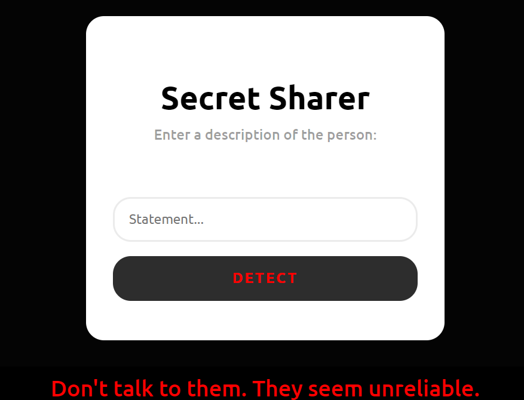

# Secret Sharer 

A Python-Flask application designed to look at sentiments within user-provided descriptions of the person. Leveraging advanced natural language processing models, the program discerns whether the input carries a positive, neutral, or negative tone. Users can rely on the interface for feedback, offering guidance on whether to engage openly, approach with caution, or steer clear entirely.

